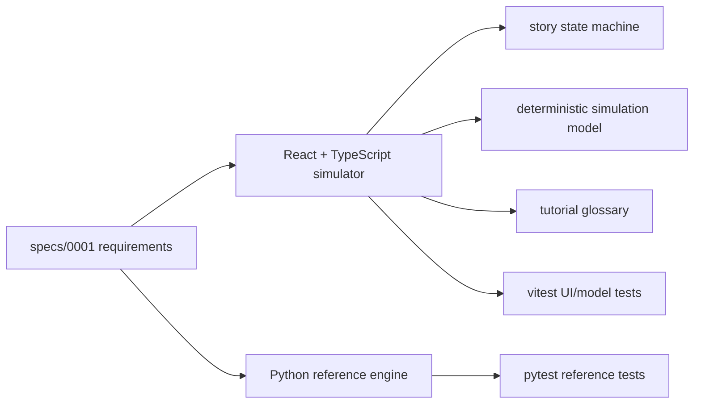

# design: polished procurement simulator

## Architecture

## Surfaces

### PLAY

PLAY is the default. It is a string-of-pearls simulator:

1. Role and stakes.
2. Round briefing.
3. One decision.
4. Consequence reveal.
5. Lesson.
6. Optional under-the-hood math.
7. Continue to next round.
8. Final debrief.

The player should never see a raw solver concept before the app has explained
why that concept matters for the decision they just made.

### LAB

LAB is the experiment arena. It answers:

- Which coordination rule performs best on this problem?
- What does more information buy?
- When does CBT make both parties no worse off?
- What changes when products, periods, or participants increase?

The lab starts from presets and lets the user widen complexity gradually.

### STUDY

STUDY is the tutorial layer. It is not a glossary dump. It explains the math
using the same case:

- Utility is the dollar score each party is optimizing.
- Residual is how far buyer and supplier quantities are apart.
- Risk score is a synthetic uncertainty knob, not a real risk rating.
- ADMM is a repeated local-solve and price-update coordination rule.
- CBT is a transfer after the physical plan is chosen.

## Stack

Primary demo:

- React 18
- TypeScript
- Vite
- Plain CSS with stable, responsive layout
- Vitest and Testing Library

Reference engine:

- Python 3.11
- Pydantic scenario schemas
- Safe formula engine
- Pytest, Hypothesis, ruff, mypy, bandit, pip-audit

## Data

The public app uses deterministic synthetic data only. The story is
semiconductor-flavored, but the lesson is generic procurement coordination.

Synthetic knobs:

- demand uncertainty
- capacity tightness
- lead time
- risk level
- information mode
- participant count
- product count
- period count

## Implementation boundaries

The frontend may reimplement simplified deterministic model logic in TypeScript
for browser hosting. The Python model remains the more formal reference engine.

No external API calls in v1.

No arbitrary formula execution in the browser in v1. Formula editing can be a
future feature once the TypeScript DSL parser has the same safety posture as the
Python formula engine.
