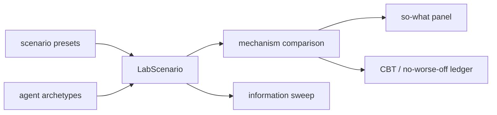

# design: lab authoring workbench

## Product thesis

The LAB should answer one sentence:

> When agents have private costs and interdependent plans, which mechanism
> recovers joint value without requiring full disclosure?

Everything else is support for that sentence.

## Architecture additions

## Canonical representations

### Scenario preset

- `id`
- `name`
- `oneLine`
- `soWhat`
- `defaults`

### Agent archetype

- `side`
- `objective`
- `privateInfo`
- `strategy`
- numeric parameters: urgency, flexibility, truthfulness, privacy preference,
  risk aversion

### Mechanism result

- global utility
- oracle gap
- residual / agreement gap
- privacy exposure
- incentive story
- information required
- iterations / runtime
- feasibility / quality

## Design choices

- Keep deterministic TypeScript formulas in v1 so browser hosting remains
  static and transparent.
- Treat external repos as references, not dependencies.
- Prefer visible causal deltas over hidden solver sophistication.
- Use source-grounded labels: CPP/ADMM, CPP+VCG/CBT, menu-of-contracts, JIT
  baseline, oracle, alternating best response, price-only, consensus averaging.
