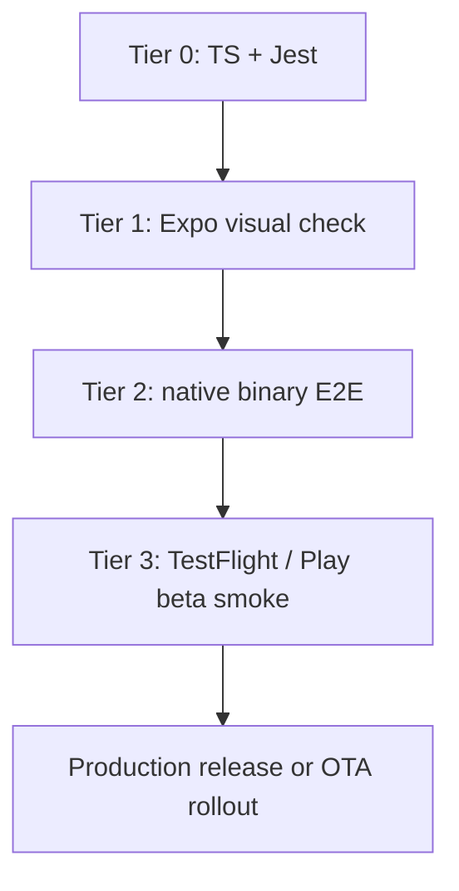
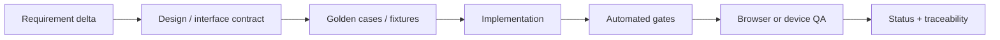

# design: mobile release discipline + agentic SDLC

## Architecture

Spec 0012 adds process infrastructure rather than a new learning surface. The
implementation should be small and enforceable:

- `apps/mobile/eas.json`: named profiles and channels.
- `.eas/workflows/`: EAS build/test workflow files when account auth is ready.
- `.github/workflows/mobile-native.yml`: GitHub-side native proof trigger or
  EAS workflow trigger wrapper.
- `docs/mobile-release-ledger.md`: durable build/update evidence.
- `scripts/spec_check.py`: keep dynamic spec discovery and add future checks
  only when a file exists to check.
- `AGENTS.md`: keep spec-first rules; extend only if the mobile proof protocol
  is not discoverable.

## Mobile Proof Ladder

Tier 0 remains the default PR gate. Tiers 2-3 are release gates because they are
slower, more account-bound, and more infrastructure-heavy.

## Agentic Development Loop

The loop is intentionally hostile to status-only proof. A claim is durable only
when it has a requirement, a test/eval, a run command, and a recorded result.

## Cross-Repo Parity Model

| Repo | Current strength | Gap to close |
|---|---|---|
| `procurement-negotiation-lab` | lightweight specs, visible learning surfaces, web/mobile tests, smoke | native mobile build/E2E ledger |
| `../cargo-health/medroute-main` | Nx graph, contract/security/chaos/mutation rings | keep live-system proof tied to current runtime, not stale green artifacts |
| `../prompt-library` | canonical workflows, prompt evals, mode wrappers | add reusable agentic SDLC workflow for mobile/product repos |
| `ai-field-brief` | new repo | bootstrap specs before code; gate LLM/source changes with evals |

## AI Brief Bootstrap Boundary

AI Brief should not be implemented inside procurement-lab. The clean shape is a
new repo with:

- `apps/web`, `apps/mobile`, `apps/extension`, `apps/mcp-server`
- `packages/db`, `packages/sources`, `packages/pipeline`, `packages/retrieval`,
  `packages/evals`, `packages/integrations`, `packages/observability`
- `inngest/` functions with step-level retries and admin replay
- `specs/` using the six-file spec pattern

Phase 0 is specs, repo scaffold, CI skeleton, and eval fixtures. Product
features start only after the ingestion/eval/orchestration contracts are clear.

