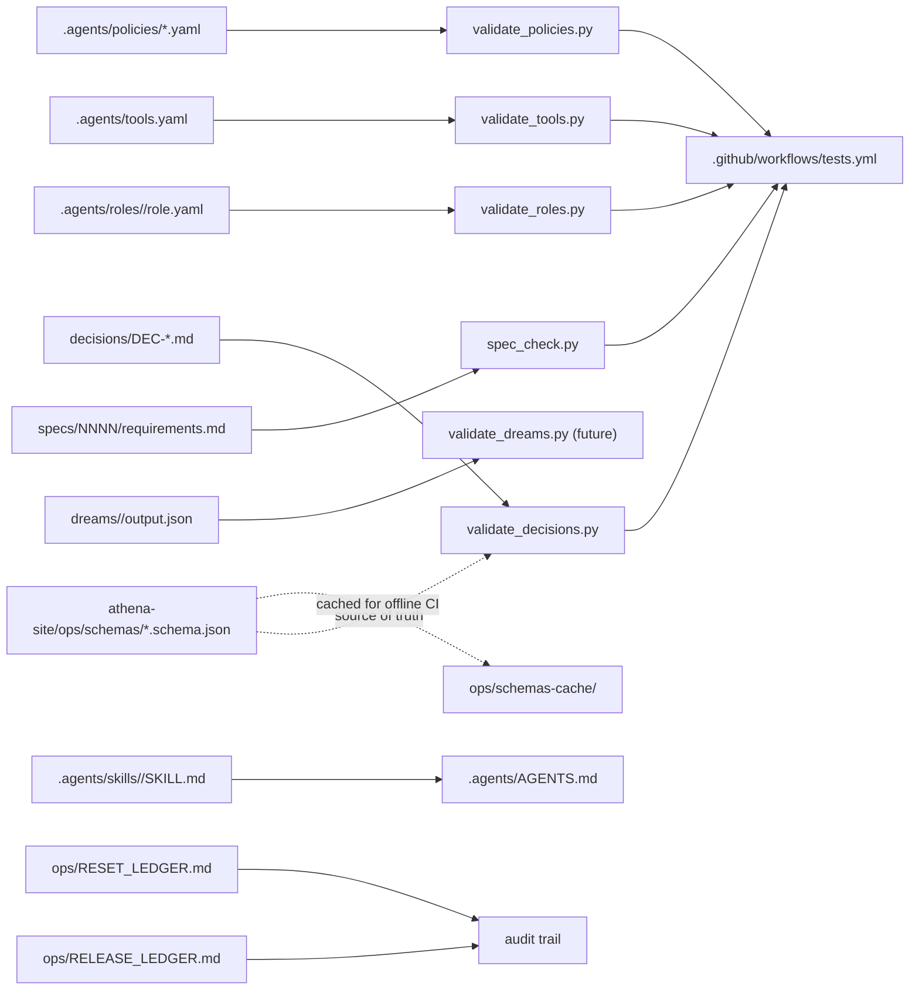

# design: cognitive-delivery-control-plane

## Shape

## Folders

### `specs/0013-cognitive-delivery-control-plane/`

The six-file ledger (`requirements`, `design`, `tasks`, `acceptance`,
`research`, `traceability`). Defines R-CDCP-001..010.

### `decisions/`

One markdown file per architectural choice. YAML front-matter holds
the structured fields the schema requires (`id`, `spec`, `requirement`,
`date`, `status`, `reversible`); body holds the narrative sections
`## decision`, `## alternatives`, `## rationale`, `## evidence`,
`## rollback`.

The repo ships one DEC in this pass: `DEC-CDCP-001-install-cdcp-governance.md`.
Every prior R-* (91 of them across specs 0001-0012) lands in
`decisions/.spec-check-allowlist.yaml` as `deferred`. Backfill DECs
ship in later passes, one cluster at a time.

### `dreams/`

One folder per week (`dreams/YYYY-WNN/`) once the weekly dream job
ships. The folder holds a human-readable `report.md` and a structured
`output.json` matching the cross-repo `dream-output.schema.json`. The
README documents the eight modes.

### `.agents/`

Holds the agent contract plus the operating-model layer:

- `AGENTS.md` — single contract a coding agent reads first.
- `skills/<id>/SKILL.md` — packaged recurring patterns. The first
  graduated skill is `run-factory-task`, which packages the existing
  `scripts/factory/` orchestrator.
- `roles/<role-id>/` — six baseline role contracts (control.coordinator,
  product.spec-writer, engineering.implementation,
  engineering.code-reviewer, science.proof-gate-runner,
  learning.dream-orchestrator). Each role carries `role.yaml`,
  `instructions.md`, `tools.yaml` (role-scoped subset), `output.schema.json`,
  and `gates.yaml`.
- `tools.yaml` — central tool registry that all roles draw from.
- `policies/*.yaml` — declarative permission rules evaluated by priority.
- `state-machines/*.yaml` — spec-lifecycle, run-lifecycle,
  release-lifecycle.
- `workflows/*.yaml` — single-change, weekly-dream, incident-response,
  mobile-release.
- `CATALOG.md` — TODO ledger of the 44 roles not yet installed.

### `ops/`

Adds two ledgers and a schemas cache, beside the existing factory
infrastructure:

- `RELEASE_LEDGER.md` — new. One entry per released commit.
- `RESET_LEDGER.md` — new. One entry per force-push or rollback.
- `schemas-cache/` — new. Mirrors the athena-site contracts so CI runs
  offline.
- `event-log/YYYY-MM-DD.jsonl` — new. One JSON event per line per day.
- `run-ledger.md`, `factory.db`, `factory-artifacts/`, `factory-tasks/`,
  `proof_gates.json`, `qa-evidence/`, `releases/` — unchanged. The
  factory subsystem keeps its existing shape.

## Scripts

### `scripts/validate_decisions.py`

1. Walks `decisions/DEC-*.md`.
2. Parses YAML front-matter from each file.
3. Loads `decision.schema.json` from the network URL with a local
   cache fallback under `ops/schemas-cache/`.
4. Validates each parsed front-matter against the schema.
5. Reports violations and exits 1; exits 0 on a clean walk.

### `scripts/validate_roles.py`

Walks `.agents/roles/<role-id>/role.yaml`, validates each against
`role.schema.json` from athena-site (cache fallback at
`ops/schemas-cache/role.schema.json`).

### `scripts/validate_tools.py`

Reads `.agents/tools.yaml`, treats each entry as a tool record, and
validates each against `tool.schema.json` (cache fallback at
`ops/schemas-cache/tool.schema.json`).

### `scripts/validate_policies.py`

Walks `.agents/policies/*.yaml`, validates each against
`policy.schema.json` (cache fallback at
`ops/schemas-cache/policy.schema.json`).

### `scripts/spec_check.py` extension

Adds a new rule: every R-* defined in requirements.md must be named by
the front-matter `requirement:` field of at least one
`decisions/DEC-*.md` file, OR listed under `deferred:` in
`decisions/.spec-check-allowlist.yaml`. R-CDCP-* IDs covered by
`DEC-CDCP-001-install-cdcp-governance.md` count as resolved through
that single DEC. The `CDCP` prefix joins the existing prefix set.

## Cross-repo links

- `../athena-site/ops/control-plane.md` — the charter that names the
  contracts.
- `../athena-site/ops/schemas/decision.schema.json` — the contract for
  DEC files in this repo.
- `../athena-site/ops/schemas/role.schema.json` — the contract for
  role records.
- `../athena-site/ops/schemas/tool.schema.json` — the contract for
  tool registry entries.
- `../athena-site/ops/schemas/policy.schema.json` — the contract for
  policy rules.
- `../athena-site/ops/schemas/skill.schema.json` — the contract for
  SKILL.md front-matter.
- `../athena-site/ops/schemas/dream-output.schema.json` — the contract
  for future dream outputs.

## Failure modes

- A new R-* lands without a DEC: `spec_check` fails the build.
- A DEC drifts out of schema shape: `validate_decisions` fails the
  build.
- A role, tool, or policy record drifts out of shape: the matching
  validator fails the build.
- The cross-repo schema is unreachable in CI: validators fall back to
  the cache under `ops/schemas-cache/`.
- A dream output proposes auto-merge: the schema's
  `human_review_required` default of `true` keeps the patch human-gated.
